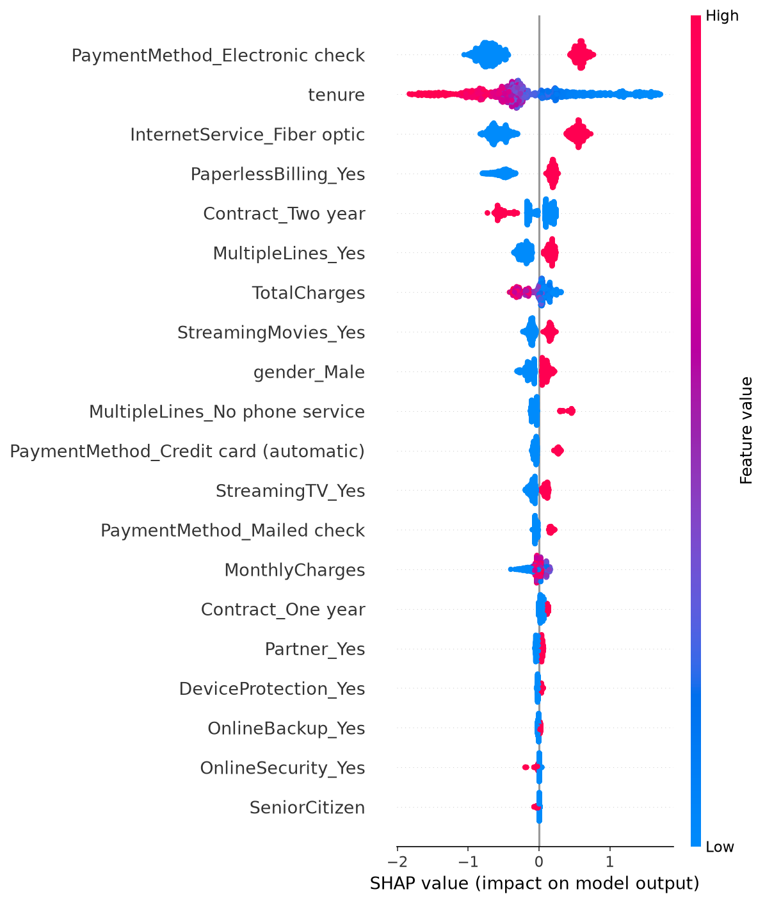

# Customer Churn Prediction

An end-to-end machine learning system that predicts whether a telecom customer will churn,
explains *why* using SHAP, and serves live predictions through a FastAPI backend + Streamlit
frontend — fully containerized with Docker.

**Live Demo:** https://churn-prediction-app-foq9.onrender.com


_[add your demo GIF here — see instructions at the bottom]_

---

## Problem Statement

Customer churn — when a customer stops using a company's service — directly impacts revenue.
Acquiring a new customer costs significantly more than retaining an existing one, so being able
to identify at-risk customers *before* they leave lets a business intervene (discounts, support
outreach, etc.).

This project builds a full ML pipeline to predict churn on the
[Telco Customer Churn dataset](https://www.kaggle.com/datasets/blastchar/telco-customer-churn)
(7,043 customers, 21 features), going beyond a notebook exercise to a deployed, explainable,
production-style application.

---

## Architecture

```
Raw CSV -> Preprocessing -> EDA -> Model Training (MLflow tracked) -> Final Model (LightGBM)
                                                                          |
                                                                          v
                                                        SHAP Explainability Layer
                                                                          |
                                                                          v
                              FastAPI Backend (/predict) <----------> Streamlit Frontend
                                                                          |
                                                                          v
                                                          Docker Container -> Deployed
```

---

## Key EDA Insights

_(Fill these in with your own 3 observations from `notebooks/01_eda.py` - example format below)_

1. Month-to-month contract customers churn significantly more than customers on 1-2 year contracts.
2. Churn is heavily concentrated among customers with low tenure (under ~10 months).
3. Customers without Tech Support or Online Security show a noticeably higher churn rate.

---

## Model Development & Results

Multiple models were trained and tracked with **MLflow**, using **SMOTE** to address class
imbalance (~73% non-churn / ~27% churn) and **GridSearchCV** (optimized for recall) for
hyperparameter tuning.

| Model | Accuracy | Precision | Recall | F1 | ROC-AUC |
|---|---|---|---|---|---|
| Logistic Regression | 76.7% | 55.5% | 59.9% | 57.6% | 82.1% |
| Random Forest | 77.3% | 56.1% | 65.9% | 60.6% | 83.3% |
| XGBoost (tuned) | 75.9% | 53.6% | 68.3% | 60.0% | 82.9% |
| **LightGBM (tuned) - Final Model** | 76.3% | 54.1% | **69.1%** | **60.7%** | 82.9% |

**Why LightGBM was selected:** Recall was prioritized as the key business metric over raw
accuracy - missing an actual churner is more costly to the business than a false alarm on a
loyal customer. LightGBM achieved the highest recall (69.1%) and F1 score after tuning,
correctly identifying roughly 7 out of 10 customers who are actually going to churn.

---

## Explainability (SHAP)

Rather than treating the model as a black box, every prediction is paired with a SHAP-based
explanation showing exactly which features drove that specific outcome.

**Global feature importance:**



**Example individual prediction:**
A customer with 12 months tenure, fiber optic internet, and electronic check payment was
predicted at **77.2% churn probability**. Top contributing factors:
- Payment via Electronic check -> increases churn risk
- Fiber optic internet service -> increases churn risk
- Having multiple phone lines -> decreases churn risk

---

## Tech Stack

| Layer | Tool |
|---|---|
| Data & Modeling | pandas, scikit-learn, XGBoost, LightGBM |
| Imbalance Handling | imbalanced-learn (SMOTE) |
| Explainability | SHAP |
| Experiment Tracking | MLflow |
| Backend API | FastAPI + Pydantic |
| Frontend | Streamlit |
| Containerization | Docker |
| Deployment | Render |

---

## Project Structure

```
churn-prediction/
├── api/
│   └── main.py                 # FastAPI backend
├── app/
│   └── streamlit_app.py        # Streamlit frontend
├── src/
│   ├── preprocessing.py        # Data cleaning pipeline
│   ├── train.py                # Baseline models (LogReg, RF)
│   ├── train_advanced.py       # Tuned models (XGBoost, LightGBM)
│   └── train_final.py          # Final model + SHAP
├── notebooks/
│   └── 01_eda.py                # Exploratory data analysis
├── models/
│   └── final_model.pkl         # Saved final model
├── Dockerfile
├── docker-entrypoint.sh
├── requirements.txt
└── README.md
```

---

## Running Locally

### Option 1: Docker (recommended - matches deployment exactly)
```bash
docker build -t churn-prediction-app .
docker run -p 8000:8000 -p 8501:8501 churn-prediction-app
```
Open http://localhost:8501

### Option 2: Manual setup
```bash
python3 -m venv venv
source venv/bin/activate
pip install -r requirements.txt

# Download the dataset from Kaggle and place it in data/raw/
python src/preprocessing.py
python src/train_final.py

# Terminal 1
uvicorn api.main:app --reload

# Terminal 2
streamlit run app/streamlit_app.py
```

---

## What I'd Improve Next

- Add re-ranking / threshold tuning to further balance precision vs recall for different
  business cost scenarios
- Expand explainability with counterfactual examples ("what would need to change for this
  customer to be predicted as low-risk?")
- Add automated retraining pipeline as new customer data arrives
- Split the single Docker container into separate backend/frontend services, matching typical
  production microservice architecture
- Add unit tests and a CI pipeline (GitHub Actions) for the preprocessing and API logic

---

## Dataset

[Telco Customer Churn Dataset](https://www.kaggle.com/datasets/blastchar/telco-customer-churn) -
IBM sample dataset via Kaggle, 7,043 rows, 21 columns.